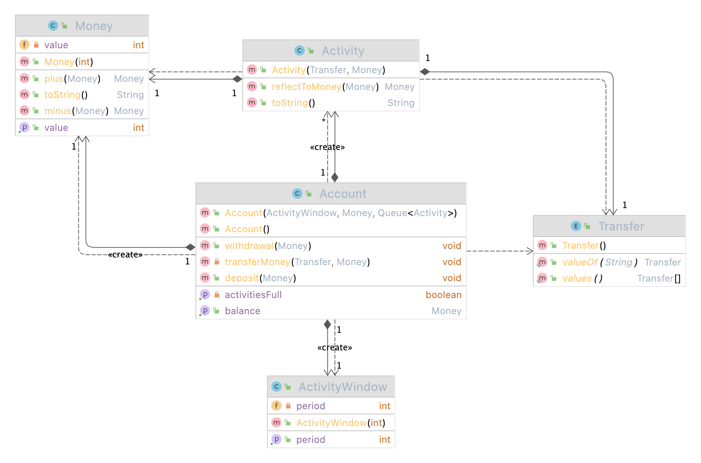

# 😄 2022.02.05

## 할일 및 한일

* [x] '소프트웨어 아키텍처' 세미나 복습  과제 수행
* [x] '레디스' 세미나 발표 자료 제작 (20%)

## 경험 및 배움

### '소프트웨어 아키텍처' 세미나 복습 및 과제 수행

연구실의 석사생들이 아키텍처에 대해 이해도가 낮으므로, 이번에 박사님이 `'소프트웨어 아키텍처'` 세미나를 준비하셔서 진행해주셨다. 해당 세미나를 수강하면서 지금까지 내가 만들었던 프로젝트들은 **계층형 아키텍처(Layered Architecture)**와 유사하다는 것을 알게 되었다.


_**계층형 아키텍처 (Layered Architecture)**_\
\
특정 계층에 컴포넌트의 역할 범위를 한정하며, 해당 계층에 알맞은 로직만 처리하도록 구성하는 아키텍처이다.



계층형 아키텍처는 데이터베이스 주도 설계를 유도하여 **도메인 계층과 영속화 계층이 강하게 결합**되도록 하는 단점이 있다. 이러한 단점을 보완하기 위해 **육각형 아키텍처(Hexagonal Architecture)**가 등장하게 된다.


이 아키텍처는 **의존 역전 원칙(DIP, Dependency Inversion Principle)**을 적용하여 내부 비즈니스 로직이 데이터베이스에 의존하는 것이 아니라, 데이터베이스가 비즈니스 로직에 의존하도록 하는 아키텍처이다.


이처럼 아키텍처에 대해 살펴보고, 박사님이 간단한 요구사항을 주시고 해당 요구사항대로 구현해오는 과제를 주셨다.

요구사항은 다음과 같다.


나는 위 요구사항대로 Java를 사용해 구현했으며, 완성된 프로그램의 클래스 다이어그램은 다음과 같다.




내가 예전보다 조금이나마 객체 지향 프로그래밍을 할 수 있음을 이번 과제를 진행하면서 느끼게 되었다.

예전에는 클래스만 사용하면 객체 지향 프로그래밍인 줄 알았으나, 지금은 **어떤 클래스가 어떤 역할을 할지** 고민을 하고 **최대한 의존을 줄이기 위해 내부 속성을 감추고 적절한 메소드를 작성**하는 나를 되돌아 볼 수 있었다. 또한 **값 객체**의 유용함과 Java Stream API에서 **reduce** 메소드의 파라미터들의 특성들을 알게 되었다.


reduce 메소드의 시그니처는 다음과 같다.

```java
<U> U reduce(U identity,
                 BiFunction<U, ? super T, U> accumulator,
                 BinaryOperator<U> combiner);
```

* `identity` : 초기값
* `accumulator` : 누적기. 두 값을 하나의 값으로 합쳐주는 역할을 한다.
* `combiner` : 결합기. 이 함수형 인터페이스는 병렬 연산으로 도출된 결과들을 집계해주는 역할을 한다. \
  즉, 병렬 처리 스트림에서만 호출된다.


Reference



### '레디스' 세미나 발표 자료 제작 (20%)

Notion에 정리해 놓은 내용을 기반으로 세미나 발표 자료를 제작하면서 어떻게 PPT 슬라이드를 구성해야 할지 고민이 되다 보니 생각보다 많이 진행하지 못 한거 같다.


## 개선 및 목표

* 요구사항을 살펴볼 때 오로지 나의 생각으로만 판단하는 경향이 있으므로, 추후에는 내가 이해한 것이 맞는지 물어보고 개발을 진행하자.

