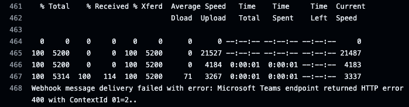

# 😊 2024.07.25

## 할일 및 한일

* [x] 회사 업무
  * [x] CI/CD 버그 해결
* [x] 사이드 프로젝트
  * [x] Spring Event 학습


## 경험 및 배움

### 회사 업무

#### CI/CD 버그 해결

어제 테스트 했던 Github Actions를 디버깅 해보니 gradle build와 docker build & push에 대한 Job을 분리하면서 version을 못 불러오는 문제로 확인됐다.

그래서 gradle build를 수행하는 Job에서 version을 Job의 outputs로 선언한 후에 version을 생성할 때 GITHUB\_OUTPUT으로 저장시키는 로직을 추가하여 해결했다.

gradle build 후에 .jar 파일을 artifacts로 저장하고 docker build & push를 수행하는 곳에서 해당 artifacts를 불러오는 형태로 수정하여 Job을 연결했다.

작성한 Github Actions yaml은 다음과 같다.

```yaml
name: Publish Test Version

on:
  push:
    branches: [ develop ]
  workflow_dispatch:

env:
  CONTAINER_CONTEXT_PATH: "docker"
  DOCKERFILE_PATH: "docker/Dockerfile"
  DOCKER_IMAGE_PATH: "obision/gateway"

jobs:
  build-test-package:
    runs-on: ubuntu-latest
    outputs:
      version: ${{ steps.extract_version_name.outputs.version }}

    timeout-minutes: 20

    steps:
      - uses: actions/checkout@v3
        with:
          token: ${{ secrets.TOKEN }}
          submodules: true

      - name: Get Current Release
        id: get_current_release
        uses: joutvhu/get-release@v1
        with:
          latest: true
        env:
          GITHUB_TOKEN: ${{ secrets.GITHUB_TOKEN }}

      - name: Extract Version Name
        id: extract_version_name
        run: |
          export currentVersion="$(echo '${{ steps.get_current_release.outputs.tag_name }}' | egrep -o '[0-9]{1,3}\.[0-9]{1,4}\.[0-9]{1,4}(\.[0-9]{1,2})?(-.*)?')"
          echo "##[set-output name=version;]$(if [ -z $currentVersion ]; then echo '0.0.0'; else echo "$currentVersion"; fi).${{ github.run_number }}"
          echo "version=$(if [ -z $currentVersion ]; then echo '0.0.0'; else echo "$currentVersion"; fi).${{ github.run_number }}" >> "$GITHUB_OUTPUT"

      - name: Build test package
        uses: gradle/gradle-build-action@v2
        with:
          arguments: build -Pversion=${{ steps.extract_version_name.outputs.version }} --parallel
        env:
          GITHUB_TOKEN: ${{ secrets.TOKEN }}

      - name: Upload build artifacts
        uses: actions/upload-artifact@v2
        with:
          name: build-artifacts
          path: build/libs/

  docker-build-and-push:
    needs: build-test-package
    runs-on: ["self-hosted", "ubuntu20.04", "gdal"]

    steps:
      - uses: actions/checkout@v3
        with:
          token: ${{ secrets.TOKEN }}
          submodules: true

      - name: Download build artifacts
        uses: actions/download-artifact@v2
        with:
          name: build-artifacts
          path: build/libs

      - name: Copy artifacts to obision/gateway
        run: cp build/libs/* ${{ env.CONTAINER_CONTEXT_PATH }}

      - name: Container Registry Login
        uses: docker/login-action@v2.1.0
        with:
          registry: ${{ secrets.CONTAINER_REGISTRY_URL }}
          username: ${{ secrets.CONTAINER_REGISTRY_ID }}
          password: ${{ secrets.CONTAINER_REGISTRY_PW }}

      - name: Inject envs
        run: |
          echo "" >> ${{ env.DOCKERFILE_PATH }}
          echo "ENV GIT_COMMIT_ID=${{ github.sha }} \\" >> ${{ env.DOCKERFILE_PATH }}
          echo "   BUILD_DATE=$(date +%Y.%m.%d) \\" >> ${{ env.DOCKERFILE_PATH }}
          echo "   VERSION=${{ needs.build-test-package.outputs.version }} \\" >> ${{ env.DOCKERFILE_PATH }}
          echo "   AUTH_SECRET=${{ secrets.AUTH_SECRET }}" >> ${{ env.DOCKERFILE_PATH }}
          echo "ENV GIT_COMMIT_ID {{ github.sha }}"
          echo "ENV BUILD_DATE $(date +%Y.%m.%d)"
          echo "ENV VERSION ${{ needs.build-test-package.outputs.version }}"

      - name: Build the Docker image
        run: docker build ${{ env.CONTAINER_CONTEXT_PATH }} --file ${{ env.DOCKERFILE_PATH }} --tag ${{ secrets.CONTAINER_REGISTRY_URL }}/${{ env.DOCKER_IMAGE_PATH }}:${{ needs.build-test-package.outputs.version }}

      - name: Push the Docker image
        run: docker push ${{ secrets.CONTAINER_REGISTRY_URL }}/${{ env.DOCKER_IMAGE_PATH }}:${{ needs.build-test-package.outputs.version }}
```

이처럼 yaml을 수정한 후에 배포하여 테스트 해보니 정상적으로 동작하는 것으로 확인됐다.

<figure><figcaption></figcaption></figure>

gateway 저장소에 반영을 완료했으니 나머지 저장소들에도 반영한 후에 전체 저장소에 대해서 CI/CD를 수행하는 테스트를 해볼 예정이다.

### 개인 프로젝트

#### Spring Events 학습

Spring Events를 학습하면서 알림 서비스를 튜토리얼로 만들기 위해 Repository를 만들고 실습을 진행했다.

{% embed url="https://github.com/LeeSM0518/notification-service/tree/%231/feat/apply-tutorial-about-spring-events" %}

실습을 진행하면서 이벤트와 발행자, 수신자에 대한 클래스를 구현하고 정상적으로 동작하는지 테스트를 진행했다. 다음과 같이 수신자를 mock으로 설정한 후에 테스트를 수행했으나 테스트를 실패하여 원인 분석 중에 있다.

```kotlin
@IntegrationTest
class CustomSpringEventPublisherTest @Autowired constructor(
    val eventPublisher: CustomSpringEventPublisher,
) {

    @MockBean
    lateinit var eventConsumer: AnnotationDrivenEventListener

    @Captor
    lateinit var captor: ArgumentCaptor<CustomSpringEvent>

    @Test
    fun `사용자 정의 이벤트를 발행할 수 있다`(): Unit = runBlocking {
        val expected = "message"
        eventPublisher.publishCustomEvent(expected)
        verify(eventConsumer, times(1)).handleCustomEvent(captor.capture())
        val actual = captor.value
        assertThat(actual).isEqualTo(expected)
    }
}
```


## 개선 및 목표

* 다른 저장소들의 Github Actions도 수정하여 CI/CD 문제 해결
* Spring Events 테스트 코드 버그 해결

